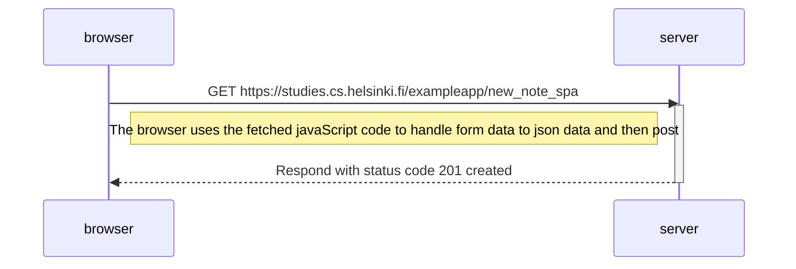

```mermaid
sequenceDiagram
    participant browser
    participant server

    browser->>server: GET https://studies.cs.helsinki.fi/exampleapp/new_note_spa
    activate server
    Note right of browser: The browser uses the fetched javaScript code to handle form data to json data and then post
    server-->>browser: Respond with status code 201 created
    deactivate server

```